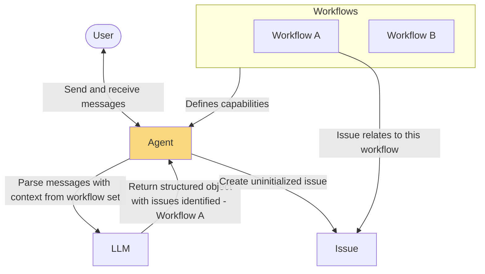
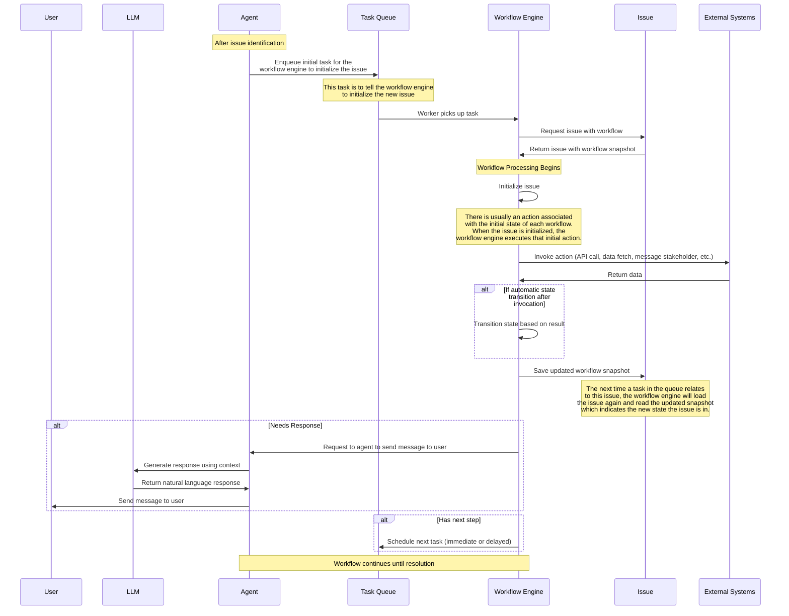
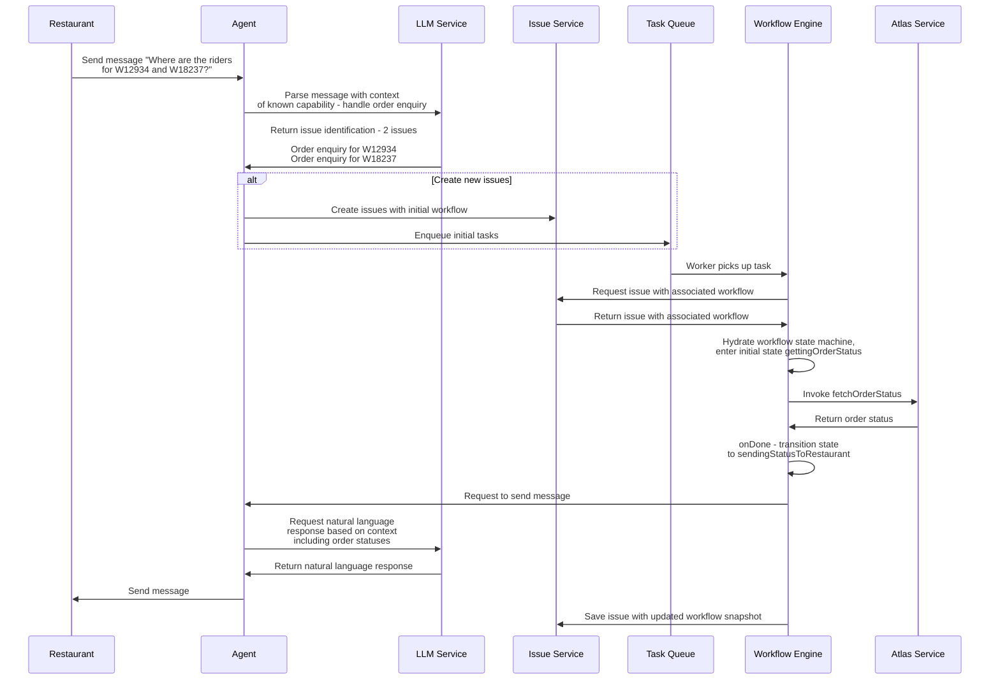

# 2. System Architecture Overview

## High-Level Architecture

### Issue identification

## Core Entities

### 1. Messages and Chats

- **Messages**: Individual messages from users
- **Chats**: Ongoing conversations with users
  - Can be 1:1 or group chats
  - Uniquely identified by `chatId`
  - Contain history of messages and associated issues

### 2. Agents

Agents are the entities that interact with users:

- Have their own configuration (tone, voice, formatting)
- Has a set of 'things that it can handle'. The set of workflows assigned to the agent determine it's capabilities.
  - E.g. if the agent has the 'answer customer FAQ' and 'handle returns/exchanges' workflows assigned to it, it knows it can handle those two issues when it parses the message and it will escalate anything else.
- Interact with users through communication channels like WhatsApp, Slack, etc.

### 3. Workflows

Workflows define logic for resolving issues:

- Implemented as XState state machines
- Might be easier to imagine as the template from which issues get created
- Describes the entire workflow for a specific kind of issue
  - What context needs to be stored in relation to the issue
  - The different steps in the issue
  - The decision points in the issue, and whether these decisions are deterministic or LLM-determined
  - The terminal states for the issue (resolution, escalation, closed due to inactivity, etc.)
- Version-controlled for reliability

https://stately.ai/registry/editor/embed/dc5cd674-7f58-441f-912a-531b0a9c2e5f?mode=design&machineId=3f225818-4fd6-4800-9c0e-bf194ecb06f1

### 4. Issues

Issues represent "things to resolve" for the agent:

- Identified from incoming customer messages
- Is an "instance" of the workflow (which is a template)
- Associated with one workflow and version of that workflow, so an ongoing issue will never change versions of the workflow
- Contains workflow snapshots representing current state

### Issue execution

## Execution services

### 1. Task Queue

Undecided if this needs to be a first-iteration. Necessary to enable non-user initiated workflows like "check every 2 minutes for late delivery orders and inform the customer", or delayed workflow steps like "send follow-up reminder after 2h if no response". Responsible for holding tasks to be processed by workers:

- Stores tasks to be picked up by workers later that process the tasks with the workflow engine.
- Supports immediate and delayed execution

### 2. Workflow Engine

Dedicated service for managing workflow execution:

- Hydrates state machines from persisted state
- Processes events and advances workflow state
- Executes side effects
- Persists updated state
- Schedules follow-up tasks

## Example - ALWA order inquiry flow

