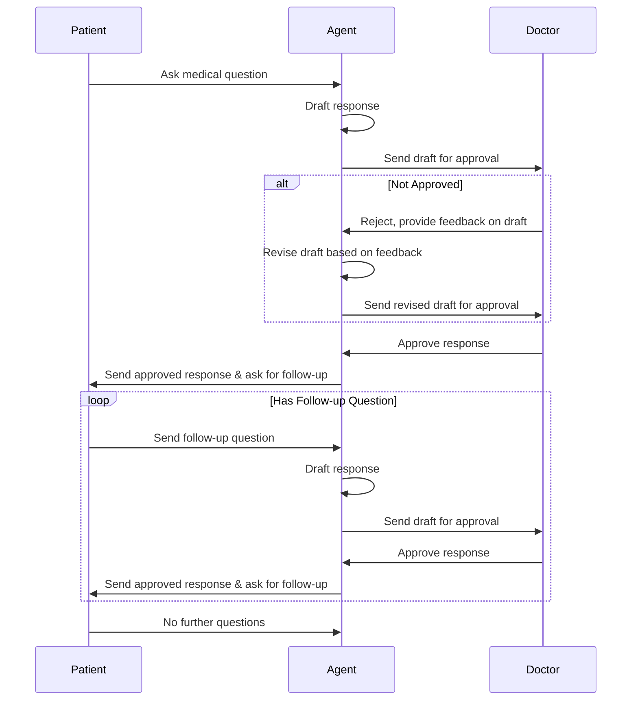

## 3. Example: Doctor Approval Workflow

Seeing an entire workflow end to end might help with understanding the architecture. The workflow:

1. Patient asks a medical question to the agent
2. Agent, for legal reasons, can't answer directly
3. Agent drafts a response, but sends to doctor for approval first
4. Doctor can approve the response or not approve and give feedback
5. If not approved, agent revises the draft based on the feedback and sends for approval again
6. Once approved, the agent proceeds to sends the approved message to the patient and asks if they have any follow-up questions
7. If the patient has follow-up questions, we start the process from the beginning again
8. If the patient is satisfied, the patientMedicalQuery workflow completes

In this case, there are two issues/workflows:

1. The patientMedicalQuery workflow - which is between the agent and the patient
2. The doctorApproval workflow - which is between the agent and the doctor, and created by the patientMedicalQuery issue



### Step 1: Patient message creates a patientMedicalQuery issue

When a patient sends a medical question, a patientMedicalQuery issue is created:

The patientMedicalQuery workflow state machine definition:

```typescript
import { createMachine, assign } from "xstate";

const patientMedicalQueryWorkflow = {
  id: "workflow_patientMedicalQuery",
  name: "Patient Medical Query",
  version: "1",

  machineDefinition: createMachine({
    id: "patientMedicalQuery",
    initial: "requestingDoctorApproval",
    context: {
      patientQuery: null, // The medical question from the patient
      doctorIssueId: null, // ID of the doctor approval issue
      approvedResponse: null, // Final approved response to send to patient
      followUpQuestion: null, // Follow-up question from patient, if any
    },
    states: {
      requestingDoctorApproval: {
        entry: ["createDoctorApprovalIssue"],
        on: {
          DOCTOR_APPROVAL_COMPLETE: {
            target: "sendingResponse",
            actions: "assignApprovedResponse",
          },
        },
      },
      sendingResponse: {
        entry: ["sendApprovedResponseToPatient"],
        always: {
          target: "waitingForFollowUp",
        },
      },
      waitingForFollowUp: {
        meta: {
          messageParsingSpec: {
            instructions:
              "You are analyzing a patient's response after receiving medical information. Determine if they have a follow-up question or if they are satisfied with the information provided.",
            fields: [
              {
                name: "hasFollowUp",
                type: "boolean",
                description: "Whether the patient has a follow-up question",
              },
              {
                name: "followUpQuestion",
                type: "string",
                description: "The patient's follow-up question, if any",
              },
              {
                name: "satisfied",
                type: "boolean",
                description:
                  "Whether the patient is satisfied with the information provided",
              },
            ],
            issueId: "{{context.issueId}}",
          },
        },
        on: {
          MESSAGE_PARSED: [
            {
              guard: "hasFollowUpQuestion",
              target: "requestingDoctorApproval",
              actions: ["updatePatientQuery", "resetApprovedResponse"],
            },
            {
              guard: "isPatientSatisfied",
              target: "completed",
            },
          ],
        },
      },
      completed: {
        type: "final",
      },
    },
  }),
  actions: {
    createDoctorApprovalIssue: async ({ context }) => {
      // This calls the function defined in Step 2
    },
    assignApprovedResponse: assign({
      approvedResponse: ({ context, event }) => event.data.approvedResponse,
    }),
    sendApprovedResponseToPatient: async ({ context }) => {
      // Send the approved response back to the patient
      // Also ask if they have any follow-up questions
      // Implementation details omitted
    },
    updatePatientQuery: assign({
      patientQuery: ({ context, event }) => event.data.followUpQuestion,
    }),
    resetApprovedResponse: assign({
      approvedResponse: null,
      doctorIssueId: null,
    }),
  },
  guards: {
    hasFollowUpQuestion: ({ context, event }) =>
      event.data.hasFollowUp === true && event.data.followUpQuestion,
    isPatientSatisfied: ({ context, event }) =>
      event.data.hasFollowUp === false,
  },
};
```

https://stately.ai/registry/editor/embed/dc5cd674-7f58-441f-912a-531b0a9c2e5f?mode=design&machineId=3f225818-4fd6-4800-9c0e-bf194ecb06f1

### Step 2: doctorApproval issue and response to patient

The doctorApproval issue will be created from the patientMedicalQuery workflow. The doctorApproval workflow:

```typescript
import { createMachine, assign } from "xstate";

// Custom actions
const requestLLMService = ({ context, input }) => {
  // Implementation for generating drafts with LLM
};

const doctorApprovalWorkflow = {
  id: "workflow_doctorApprovalForMedicalQuery",
  name: "Doctor Approval For Medical Query",
  version: "1",
  // ... other workflow properties

  // State machine definition
  machineDefinition: createMachine({
    id: "doctorApprovalForMedicalQuery",
    initial: "draftingResponse",
    context: {
      patientIssueId: null, // ID of the original patient medical query issue
      patientQuery: null, // The original medical question from the patient
      draftResponse: null, // The current draft response to be approved
      draftHistory: [], // Array of previous drafts for reference
      doctorFeedback: [], // Array of previous feedback from the doctor
      attempts: 0, // Number of approval attempts made
      approvedResponse: null, // Final approved response
    },
    states: {
      draftingResponse: {
        entry: ["getDraftResponseFromLLM", "updateDraftHistory"],
        always: {
          target: "sendingDraft",
        },
      },
      sendingDraft: {
        always: {
          target: "waitingForReview",
        },
      },
      waitingForReview: {
        meta: {
          messageParsingSpec: {
            instructions:
              "You are analyzing a doctor's response to a draft medical response. Determine if the doctor has approved the draft or not, and extract any feedback provided.",
            fields: [
              {
                name: "approved",
                type: "boolean",
                description:
                  "Whether the doctor has approved the draft response. If feedback is provided, set to false.",
              },
              {
                name: "feedback",
                type: "string",
                description:
                  "Any feedback or suggested changes from the doctor",
              },
            ],
            issueId: "{{context.issueId}}",
          },
        },
        on: {
          MESSAGE_PARSED: [
            {
              guard: "isApproved",
              target: "approved",
              actions: "storeApprovedResponse",
            },
            {
              guard: "isRejected",
              target: "draftingResponse",
              actions: "storeFeedback",
            },
          ],
        },
      },
      approved: {
        entry: ["notifyPatientWorkflow"],
        always: {
          target: "completed",
        },
      },
      completed: {
        type: "final",
      },
    },
  }),
  actions: {
    requestLLMService,
    updateDraftHistory: assign({
      attempts: ({ context }) => context.attempts + 1,
      draftHistory: ({ context }) => [
        ...context.draftHistory,
        context.draftResponse,
      ],
    }),
    storeApprovedResponse: assign({
      approvedResponse: ({ context, event }) => event.data.draftResponse,
    }),
    storeFeedback: assign({
      doctorFeedback: ({ context, event }) => [
        ...context.doctorFeedback,
        event.data.feedback,
      ],
    }),
    notifyPatientWorkflow: async ({ context }) => {
      await issueService.sendEventToIssue({
        issueId: context.patientIssueId,
        event: {
          type: "DOCTOR_APPROVAL_COMPLETE",
          data: {
            approvedResponse: context.approvedResponse,
          },
        },
      });
    },
  },
  guards: {
    isApproved: ({ context, event }) => event.data.approved === true,
    isRejected: ({ context, event }) => event.data.approved === false,
  },
};
```

https://stately.ai/registry/editor/embed/dc5cd674-7f58-441f-912a-531b0a9c2e5f?mode=design&machineId=92b9700c-a83c-4a3d-a114-c6b9ece5639b

### How the agent parses the responses from doctor approval

We will go through the flow for parsing the doctor approval message. The 'does the patient have any follow up' message will be the same flow, just with a different parsing spec.

The `waitingForReview` state of the workflow now contains a `meta.messageParsingSpec` property as shown in the state machine definition above. This spec contains:

1. Instructions for the LLM on how to parse the doctor's response
2. Fields to extract from the message (approved status and feedback)
3. The issue ID to associate the parsed data with

When a doctor responds to a query with:

> "The draft looks good, but please clarify that the medication should be taken with food to minimize stomach discomfort."

On receiving the message the agent:

1. Identifies all the active issues between the agent and the doctor and finds this `doctorApproval` issue in the `waitingForReview` state
2. Looks for `meta.messageParsingSpec` for the current state and if present, retrieves it
3. Assembles the prompt to the LLM including the instructions in the spec, to parse the message
4. Receives structured data:

   ```json
   {
     "issueId": "a912ubd",
     "fields": {
       "approved": false,
       "feedback": "Please clarify that the medication should be taken with food to minimize stomach discomfort."
     }
   }
   ```

5. Sends a `MESSAGE_PARSED` event with this data to the state machine

### Step 4: State Machine Handles the Parsed Result

The state machine receives the `MESSAGE_PARSED` event with the parsed data and:

1. Checks its guards to determine which transition to take
2. Since `approved` is `false`, transitions directly to the `draftingResponse` state
3. Executes the `storeFeedback` action to update its context with the feedback
4. Continues workflow execution by generating a revised draft incorporating the feedback
5. When eventually approved, the `notifyPatientWorkflow` action will send the DOCTOR_APPROVAL_COMPLETE event to the patient workflow
6. The patient workflow will then send the approved response to the patient and complete

### Step 5: Agent Parses a Patient's Follow-up Response

Similarly, the `waitingForFollowUp` state in the patientMedicalQuery workflow contains its own `meta.messageParsingSpec` as shown in the state machine definition above.

When a patient responds after receiving an approved medical response:

> "Thanks for the information. I do have a follow-up question: how long should I take this medication?"

On receiving the message, the agent:

1. Identifies the active patientMedicalQuery issue in the `waitingForFollowUp` state
2. Retrieves the `meta.messageParsingSpec` for that state
3. Assembles the prompt to the LLM to parse the message according to the instructions and fields
4. Receives structured data:
   ```json
   {
     "issueId": "b874fde",
     "fields": {
       "hasFollowUp": true,
       "followUpQuestion": "How long should I take this medication?",
       "satisfied": false
     }
   }
   ```
5. Sends a `MESSAGE_PARSED` event with this data to the state machine

If the patient response indicates no follow-up:

> "Thanks for the information. That answers my question completely."

The parsed data would be:

```json
{
  "issueId": "b874fde",
  "fields": {
    "hasFollowUp": false,
    "followUpQuestion": null,
    "satisfied": true
  }
}
```

### Step 6: State Machine Handles the Patient's Response

The state machine receives the `MESSAGE_PARSED` event with the parsed data and:

1. Checks its guards to determine which transition to take
2. If `hasFollowUp` is `true`, transitions back to the `requestingDoctorApproval` state with the new question
3. If `hasFollowUp` is `false`, transitions to the `completed` state
4. If transitioning back to `requestingDoctorApproval`, it will reset the relevant context and create a new doctor approval issue for the follow-up question
5. The cycle continues until the patient is satisfied with all their questions answered
